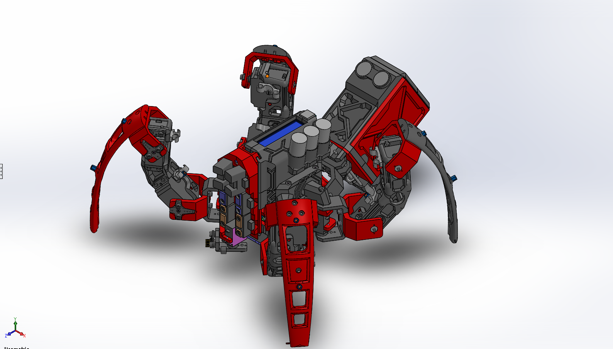

# MarkII 

The goal of this project is to make a cheap but advanced robot platform as possible. The markII techspider is an inprogress quadrupped robot project that I'm developing over the past 2 years. The front is customizable for any type of sensor you like to add.

